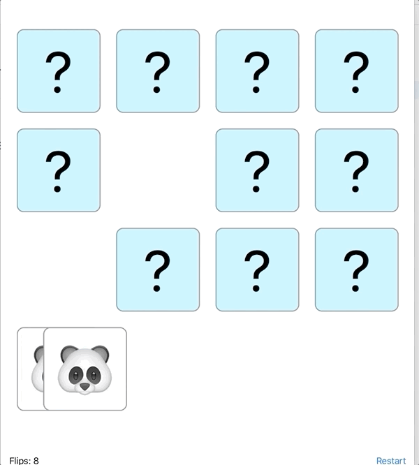

#Matching card game designed to explore the following SwiftUI features and patterns:

*  `PreferenceKey` both for sizing and to update animations
*  `AnimatableModifier` for a variety of custom animations
* A redux inspired action dispatch and reducer
* A stream of sequential animatable transactions, allowing thew view to decide the timing and nature of the animations while keeping the state updates in the viewModel.

